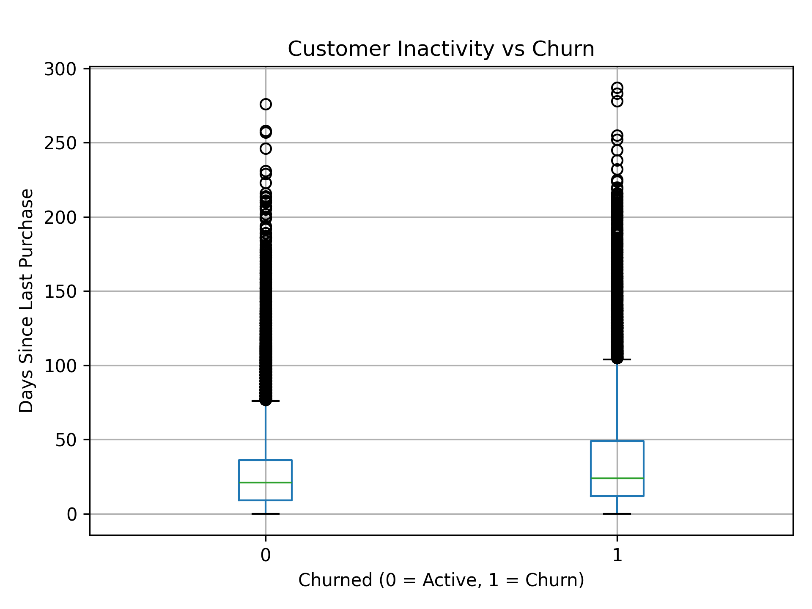

## 🚀 Customer Churn Analysis

Understanding why customers leave is critical for any business.

In this project, I analyzed customer behavior data to identify key factors that drive churn and provide actionable business insights to improve retention.

## 🔥 Key Findings (Quick Summary)

- Customers who have not made a purchase for a long time are more likely to churn
- Lower login frequency strongly correlates with churn
- Low social media engagement increases churn risk
- Discounts help improve customer retention

## 📌 Project Overview
Project ini bertujuan untuk menganalisis perilaku customer dalam platform e-commerce dan mengidentifikasi faktor utama yang menyebabkan customer churn.

Churn adalah kondisi ketika customer berhenti menggunakan layanan atau tidak lagi melakukan pembelian.

## 📊 Key Visualization

This visualization shows that customers who have not made a purchase for a longer period are significantly more likely to churn.

---

## 🎯 Objectives
- Memahami perbedaan antara customer churn dan tidak churn
- Mengidentifikasi faktor utama yang mempengaruhi churn
- Memberikan insight berbasis data untuk meningkatkan retensi customer

---

## 📂 Dataset
Dataset berisi informasi customer seperti:
- Demografi (Age, Gender, Country)
- Aktivitas (Login_Frequency, Session_Duration_Avg)
- Perilaku pembelian (Total_Purchases, Average_Order_Value)
- Engagement (Social_Media_Engagement_Score, Email_Open_Rate)
- Status churn (Churned)

---

## 🧹 Data Cleaning
Beberapa langkah yang dilakukan:
- Mengatasi missing values menggunakan **median imputation**
- Menghapus data duplikat
- Validasi range nilai (tidak ada nilai tidak logis seperti negatif)
- Standarisasi format data

---

## 📊 Exploratory Data Analysis (EDA)

Analisis dilakukan dengan membandingkan customer:
- Churn (1)
- Tidak churn (0)

Beberapa metode:
- Groupby analysis
- Perbandingan rata-rata
- Visualisasi (bar chart & boxplot)

---

## 🔥 Key Insights

### 🥇 1. Days_Since_Last_Purchase (Faktor Terkuat)
Customer churn memiliki jarak waktu pembelian yang jauh lebih lama.

👉 Insight:
Customer yang tidak aktif dalam waktu lama memiliki risiko churn tinggi.

---

### 🥈 2. Login_Frequency
Customer churn memiliki frekuensi login yang lebih rendah.

👉 Insight:
Semakin jarang customer login, semakin besar kemungkinan churn.

---

### 🥉 3. Social_Media_Engagement_Score
Customer churn memiliki engagement yang lebih rendah.

👉 Insight:
Kurangnya interaksi dengan platform meningkatkan risiko churn.

---

### 💸 4. Discount_Usage_Rate
Customer aktif cenderung lebih sering menggunakan diskon.

👉 Insight:
Promo dan diskon dapat membantu meningkatkan retensi customer.

---

## 📈 Visualizations
Project ini menggunakan beberapa visualisasi:
- Churn distribution
- Boxplot per feature
- Perbandingan engagement dan aktivitas

---

## 🧠 Business Recommendations

Berdasarkan analisis:

1. 🎯 **Re-engagement Strategy**
   - Target customer yang lama tidak melakukan pembelian
   - Kirim email / promo khusus

2. 📱 **Increase Engagement**
   - Tingkatkan interaksi melalui social media & aplikasi
   - Push notification untuk meningkatkan login

3. 💸 **Promotion Strategy**
   - Gunakan diskon untuk mempertahankan customer
   - Fokus ke customer dengan aktivitas menurun

---

## 🚀 Conclusion
Churn terutama dipengaruhi oleh rendahnya aktivitas dan engagement customer. Dengan strategi yang tepat, perusahaan dapat mengurangi churn dan meningkatkan loyalitas customer.

---

## 🛠 Tools Used
- Python
- Pandas
- Matplotlib
- Jupyter Notebook

---

## 👤 Author
Project ini dibuat sebagai bagian dari pembelajaran Data Science & Data Analytics untuk membangun portfolio profesional.
